		

**UNIVERSIDAD PRIVADA DE TACNA**

**FACULTAD DE INGENIERIA**

**Escuela Profesional de Ingeniería de Sistemas**

` `**Dashboard de Monitoreo de Repositorios Académicos en GitHub: Tendencias en Desarrollo y Gestión de Proyectos de los estudiantes en la facultad de Ingeniería de Sistemas**

Curso: Inteligencia de Negocios

Docente: Patrick Cuadros Quiroga

Integrantes:

***Chambi Cori , Jerson Roni	(2021072619)***

***Flores Quispe, Jaime Elias	(2021070309)***

***Leyva Sardon, Elvis Ronald	(2021072614)***

**Tacna – Perú**

***2025***

|CONTROL DE VERSIONES||||||
| :-: | :- | :- | :- | :- | :- |
|Versión|Hecha por|Revisada por|Aprobada por|Fecha|Motivo|
|1\.0|MPV|ELV|ARV|10/10/2020|Versión Original|

**Sistema *{ Dashboard de Monitoreo de Repositorios Académicos en GitHub: Tendencias en Desarrollo y Gestión de Proyectos de los estudiantes en la facultad de Ingeniería de Sistemas***

***}***

**Documento de Arquitectura de Software**

**Versión *{1.0}***

INDICE GENERAL

[***1.***](#_30j0zll)[***INTRODUCCIÓN	5***](#_30j0zll)

[**1.1.**](#_1fob9te)[**Propósito (Diagrama 4+1)	5**](#_1fob9te)

[**1.2.**](#_3znysh7)[**Alcance	5**](#_3znysh7)

[**1.3.**](#_2et92p0)[**Definición, siglas y abreviaturas	5**](#_2et92p0)

[**1.4.**](#_tyjcwt)[**Organización del documento	5**](#_tyjcwt)

[***2.***](#_3dy6vkm)[***OBJETIVOS Y RESTRICCIONES ARQUITECTONICAS	5***](#_3dy6vkm)

[2.1.1.](#_1t3h5sf)[Requerimientos Funcionales	5](#_1t3h5sf)

[2.1.2.](#_2s8eyo1)[Requerimientos No Funcionales – Atributos de Calidad	5](#_2s8eyo1)

[***3.***](#_17dp8vu)[***REPRESENTACIÓN DE LA ARQUITECTURA DEL SISTEMA	6***](#_17dp8vu)

[**3.1.**](#_26in1rg)[**Vista de Caso de uso	6**](#_26in1rg)

[3.1.1.](#_lnxbz9)[Diagramas de Casos de uso	6](#_lnxbz9)

[**3.2.**](#_35nkun2)[**Vista Lógica	6**](#_35nkun2)

[3.2.1.](#_44sinio)[Diagrama de Subsistemas (paquetes)	7](#_44sinio)

[3.2.2.](#_2jxsxqh)[Diagrama de Secuencia (vista de diseño)	7](#_2jxsxqh)

[3.2.3.](#_z337ya)[Diagrama de Colaboración (vista de diseño)	7](#_z337ya)

[3.2.4.](#_3j2qqm3)[Diagrama de Objetos	7](#_3j2qqm3)

[3.2.5.](#_1y810tw)[Diagrama de Clases	7](#_1y810tw)

[3.2.6.](#_4i7ojhp)[Diagrama de Base de datos (relacional o no relacional)	7](#_4i7ojhp)

[**3.3.**](#_2xcytpi)[**Vista de Implementación (vista de desarrollo)	7**](#_2xcytpi)

[3.3.1.](#_1ci93xb)[Diagrama de arquitectura software (paquetes)	7](#_1ci93xb)

[3.3.2.](#_3whwml4)[Diagrama de arquitectura del sistema (Diagrama de componentes)	7](#_3whwml4)

[**3.4.**](#_qsh70q)[**Vista de procesos	7**](#_qsh70q)

[3.4.1.](#_3as4poj)[Diagrama de Procesos del sistema (diagrama de actividad)	8](#_3as4poj)

[**3.5.**](#_1pxezwc)[**Vista de Despliegue (vista física)	8**](#_1pxezwc)

[3.5.1.](#_49x2ik5)[Diagrama de despliegue	8](#_49x2ik5)

[***4.***](#_2bn6wsx)[***ATRIBUTOS DE CALIDAD DEL SOFTWARE	8***](#_2bn6wsx)

[**Escenario de Funcionalidad	8**](#_2p2csry)

[**Escenario de Usabilidad	8**](#_147n2zr)

[**Escenario de confiabilidad	9**](#_3o7alnk)

[**Escenario de rendimiento	9**](#_23ckvvd)

[**Escenario de mantenibilidad	9**](#_ihv636)

[**Otros Escenarios	9**](#_32hioqz)

1. INTRODUCCIÓN

1. Propósito (Diagrama 4+1)

El presente documento tiene como objetivo definir el diseño arquitectónico y detallado del sistema de monitoreo de repositorios académicos en GitHub, alineado a los requerimientos funcionales y no funcionales establecidos en los documentos previos (FD01, FD02, FD03). Para garantizar una visión completa, se utiliza la metodología "Vistas 4+1" de Philippe Kruchten, que organiza el diseño en cinco perspectivas clave:

- Vista Lógica: Describe la estructura del sistema mediante diagramas de clases y paquetes, identificando entidades como Repositorio, Commit, PullRequest, y sus relaciones.
- Vista de Procesos: Detalla la interacción entre componentes mediante diagramas de secuencia (ej: flujo de "Generar métricas de actividad") y diagramas de actividades.
- Vista Física: Especifica la infraestructura de despliegue, incluyendo la integración con Power BI para visualización y GitHub API para extracción de datos.
- Vista de Desarrollo: Organiza los módulos del sistema (ETL con Power Query, análisis con Python, y dashboards en Power BI) y su asignación a equipos.
- Escenarios clave: Ilustra casos de uso críticos como "Identificación de tecnologías utilizadas" y "Evaluación de frecuencia de commits", vinculándolos a las vistas anteriores.

  Este enfoque asegura que el diseño cumpla con los objetivos académicos de la Universidad Privada de Tacna: automatizar evaluaciones, promover buenas prácticas en GitHub y generar insights accionables para docentes y estudiantes.

  1. Alcance

El informe se centrará en proporcionar el diseño técnico detallado del sistema de monitoreo de repositorios académicos
- ## **Descripción General del Proyecto:**
  - Introducción detallada al sistema "Casa de Cambio en Línea", incluyendo su propósito, objetivos y beneficios esperados tanto para usuarios como para la empresa.

- ## **Visión y Misión:**
  - Visión: "Ser la herramienta líder en evaluación objetiva de repositorios académicos, impulsando estándares profesionales en el uso de GitHub".
  - Misión: "Automatizar la supervisión de proyectos estudiantiles mediante métricas de actividad, calidad de código y colaboración, reduciendo en un 50% el tiempo de evaluación manual (FD01, sección 1.4)".

- ## **Análisis del Contexto y Problemas a Resolver:**
  ## Problemas actuales:
  - Evaluación manual y subjetiva de repositorios
  - Falta de métricas estandarizadas para commits, PRs e issues.
  - Retroalimentación tardía a estudiantes.

- ## **Objetivos del Negocio y Diseño:**

|Tipo|Objetivo|Referencia|
| :- | :- | :- |
|Negocio|Reducir en 30% los reprobados por mala gestión de repositorios (FD01, p. 7).|FD01 (4.2.5)|
|Diseño|Dashboards en Power BI con métricas de commits, tecnologías y documentación.|FD03 (RF-02, RF-03)|

- ## **Especificación de Requerimientos de Software:**
  Requerimientos Clave:

**RF-03 (Análisis de actividad):**

- Extraer commits, issues y PRs mediante GitHub API.
- Métricas: Frecuencia de contribuciones, issues abiertos/cerrados.

  **RF-05 (Identificación de tecnologías):**

- Detección de lenguajes con GitHub API (/repos/{owner}/{repo}/languages).

  **RNF-02 (Escalabilidad):**

- Soporte para 500 repositorios simultáneos (FD01, p. 7).

  **Reglas de Negocio:**

- RN-01: Autenticación obligatoria con OAuth2 (FD03, p. 11).
- RN-04: Repositorios válidos deben tener al menos 1 commit y archivos fuente (FD03, p. 12).

- ## **Diagrama 4+1:**
  Vista Lógica

La vista lógica del sistema se estructura alrededor de tres entidades principales:

- Clase Repositorio: Contiene los atributos fundamentales como nombre del repositorio, lista de commits asociados y lenguajes de programación detectados. Esta clase mantiene una relación de composición (1 a muchos) con la clase Commit.
- Clase Commit: Almacena información clave sobre cada commit, incluyendo el autor y la fecha de realización. Cada instancia de Commit pertenece a un único Repositorio.
- Clase Lenguaje: (Implícita en el diseño) Registraría los lenguajes detectados en cada repositorio con sus porcentajes de uso.

  Esta estructura permite modelar el dominio principal del sistema: el análisis de repositorios académicos con sus respectivas actividades y tecnologías utilizadas.

Vista de Procesos

- El flujo para generar métricas de actividad sigue esta secuencia:
- El usuario (docente o estudiante) solicita métricas a través de la interfaz de Power BI.
- Power BI envía una solicitud a la API de GitHub para obtener los commits del repositorio especificado.
- La API de GitHub responde con los datos brutos de los commits.
- Power BI delega el cálculo de métricas (como frecuencia de commits) a un script Python.
- Python procesa los datos y devuelve las métricas calculadas.
- Finalmente, Power BI presenta estas métricas al usuario mediante gráficos interactivos.

  Este proceso se ejecuta cada vez que un usuario solicita datos actualizados, garantizando información en tiempo real.

Vista Física

- La infraestructura de despliegue consta de tres componentes principales:
- Power BI Service: Aloja los dashboards interactivos que muestran las métricas a usuarios finales. Permite filtrar datos por repositorio, estudiante o período de tiempo.
- AWS EC2: Contiene las instancias que ejecutan:
- Procesos ETL con Power Query para extraer y transformar datos
- Scripts Python para análisis avanzado
- Conexiones seguras a la API de GitHub
- GitHub API: Servicio externo que provee todos los datos crudos sobre repositorios, commits, issues y lenguajes de programación.

  La comunicación entre estos componentes se realiza mediante APIs REST seguras y conexiones cifradas.

Vista de Desarrollo

El sistema se organiza en tres módulos principales:

**github\_connector.py:**

- Gestiona la conexión autenticada con GitHub API
- Implementa mecanismos de paginación para grandes volúmenes de datos
- Maneja los límites de tasa (rate limits) de la API

  **metrics\_calculator.py:**

- Utiliza Pandas para calcular métricas clave:

  Frecuencia semanal/mensual de commits

- Ratio de issues cerrados vs. abiertos
- Distribución de lenguajes por repositorio
- Genera datasets optimizados para visualización

  **powerbi\_dashboards.pbix:**

  Contiene los reportes preconfigurados:

- Dashboard de actividad general
- Vista detallada por estudiante
- Análisis comparativo entre repositorios
- Implementa filtros interactivos y tooltips explicativos

Escenarios clave

- Escenario 1: Docente visualiza frecuencia de commits
  - El docente selecciona un curso y período académico
  - El sistema muestra un heatmap de commits por estudiante/fecha
  - El docente identifica patrones de actividad irregular
  - El sistema permite descargar un reporte PDF con hallazgos
- Escenario 2: Estudiante consulta tecnologías
  - El estudiante autentica con su cuenta GitHub
  - El sistema detecta automáticamente sus repositorios académicos
  - Muestra un breakdown de lenguajes usados y su evolución temporal
  - Ofrece recomendaciones de buenas prácticas específicas

- ## **Viabilidad del Sistema:**
  Viabilidad Técnica

  - El proyecto demuestra sólida viabilidad técnica al basarse en:
  - Tecnologías maduras y ampliamente documentadas (Python, GitHub API, Power BI)
  - Arquitectura escalable en la nube (AWS EC2)
  - Protocolos estándar de seguridad (OAuth2, HTTPS)
  - Capacidad para procesar hasta 500 repositorios simultáneos (FD01, p.7)
  - Compatibilidad garantizada con navegadores modernos (Chrome, Firefox, Edge)

Viabilidad Operativa

- Adopción gradual: Plan piloto con 3 cursos iniciales (FD01, p.10)
- Capacitación: Talleres de 2 horas para docentes y estudiantes
- Soporte: Equipo de TI de la universidad para mantenimiento
- Integración: Compatible con el flujo de trabajo académico existente

Viabilidad Económica

- Concepto	Costo (S/)	Justificación
- Desarrollo	7,500	Incluye backend, ETL y dashboards
- Infraestructura	3,338	Hosting AWS por 12 meses
- Operación	1,350	Mantenimiento y soporte
- Total	11,648	ROI estimado en 2 años (ahorro de S/5,000 anuales en horas docentes)

Viabilidad Legal

- Cumple con Ley N°29733 de protección de datos personales (Perú)
- Respeta términos de servicio de GitHub Education
- Licencia MIT para el código desarrollado
- Políticas claras de uso académico (FD01, p.10)

Viabilidad Social

- Beneficia a 50+ estudiantes por semestre (FD02, p.6)
- Reduce conflictos por evaluaciones subjetivas
- Promueve estándares profesionales desde la academia
- 91% de estudiantes interesados en aprender buenas prácticas (FD01, p.7)

- ## **Levantamiento de Información y Conclusión:**
  **Hallazgos Clave:**

**Problemas Actuales:**

- 68% de estudiantes no usan issues para gestión de tareas
- 72% no utilizan pull requests para revisiones
- 85% reciben retroalimentación tardía (2+ semanas)

  **Benchmarking:**

- Soluciones comerciales (GitPrime) son costosas (USD $1,500+/mes)
- Herramientas existentes no adaptadas a contextos académicos

  **Requerimientos:**

- Prioridad alta para métricas de commits y tecnologías (RF-02, RF-03)
- Necesidad de autenticación segura (RNF-01)

  **Metodología:**

- Encuestas a 50 estudiantes (FD01, p.7)
- Análisis de 20 repositorios académicos muestrales
- Revisión de 5 herramientas similares en el mercado

\* 

1. Definición, siglas y abreviaturas
\*\

**RF**: Requerimiento Funcional

   **RNF**: Requerimiento No Funcional

   **API**: Interfaz de Programación de Aplicaciones

   **BD**: Base de Datos

   **UI**: Interfaz de Usuario (User Interface)

   **CPU**: Unidad Central de Procesamiento (Central Processing Unit)

   **RAM**: Memoria de Acceso Aleatorio (Random Access Memory)

   **HTTPS**: Protocolo seguro de transferencia de hipertexto (Hypertext Transfer Protocol Secure)

   **URL**: Localizador Uniforme de Recursos (Uniform Resource Locator)

   **DNS**: Sistema de Nombres de Dominio (Domain Name System)

   **HTML**: Lenguaje de Marcado de Hipertexto (Hypertext Markup Language)

   **CSS**: Hojas de Estilo en Cascada (Cascading Style Sheets)

   **SSL/TLS**: Capa de sockets seguros / Protocolo de Seguridad de la Capa de Transporte (Secure Sockets Layer / Transport Layer Security)

   **VPN**: Red Privada Virtual (Virtual Private Network)

   **API REST**: Interfaz de Programación de Aplicaciones Representacional (Representational State Transfer)

   **JSON**: Notación de Objetos JavaScript (JavaScript Object Notation)

   **XML**: Lenguaje de Marcado Extensible (eXtensible Markup Language)

1. Organización del documento

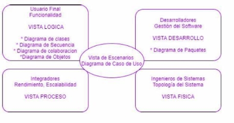

1. # **OBJETIVOS Y RESTRICCIONES ARQUITECTONICAS**
   [Establezca las prioridades de los requerimientos y las restricciones del proyecto)

   1. Priorización de requerimientos

      1. Requerimientos Funcionales

|**ID**|**Requerimiento Funcional**|**Descripción**|**Prioridad**|
| :- | :- | :- | -: |
|

RF1
|

Registro de Usuario
|
Los usuarios deben poder registrarse en la plataforma proporcionando información básica como nombre, dirección de correo

electrónico y contraseña.
|

Alta
|
|

RF2
|

Autenticación de Usuario
|Los usuarios registrados deben poder iniciar sesión en sus cuentas utilizando un nombre de usuario y contraseña seguros.|

Alta
|
|

RF3
|

Consulta de Tasas de Cambio
|Los usuarios deben poder consultar las tasas de cambio actualizadas entre diferentes pares de divisas.|

Alta
|
|

RF4
|

Realización de Transacciones
|
Los usuarios deben poder realizar transacciones de cambio de divisas de manera segura y eficiente, eligiendo entre

diferentes métodos de pago aceptados.
|

Alta
|
|

RF5
|

Historial de Transacciones
|
Los usuarios deben tener acceso a un historial detallado de todas las transacciones  de  cambio  de  divisas

realizadas en la plataforma.
|

Alta
|
|

RF6
|

Notificaciones y Alertas
|
La plataforma debe ser capaz de enviar notificaciones y alertas relevantes a los usuarios, como confirmaciones de transacciones y cambios en las tasas de

cambio.
|

Medio
|

|

RF7
|

Soporte al Cliente
|
Debe existir un sistema de soporte al cliente accesible para ayudar a los usuarios con consultas, problemas técnicos o cualquier otro tipo de asistencia relacionada con las transacciones de

cambio de divisas.
|

Bajo
|
| :- | :- | :-: | :- |

1. Requerimientos No Funcionales - Atributos de Calidad
   *\
 

|

**ID**
|
**Requerimiento No**

**Funcional**
|

**Descripción**
|

**Prioridad**
|
| :- | :- | :- | :- |
|

RNF 1
|

Usabilidad
|
La plataforma debe ser fácil de usar y navegar, con una interfaz intuitiva que permita a los usuarios encontrar rápidamente la información que necesitan y

realizar acciones sin dificultad.
|

Alta
|
|

RNF 2
|

Rendimiento
|
La plataforma debe ser rápida y eficiente, con tiempos de carga cortos y respuesta inmediata a las acciones del usuario, incluso en momentos de alta

demanda.
|

Alta
|
|

RNF 3
|

Disponibilidad
|
La plataforma debe estar disponible las 24 horas del día, los 7 días de la semana, con un tiempo de inactividad mínimo planificado para mantenimiento y

actualizaciones.
|

Alta
|
|

RNF 4
|

Seguridad
|
Se deben implementar medidas de seguridad robustas para proteger la información personal y financiera de los usuarios, incluyendo encriptación de datos, autenticación de dos factores y protección contra

ataques cibernéticos.
|

Alta
|
|

RNF 5
|

Escalabilidad
|
La plataforma debe ser capaz de manejar un alto volumen de usuarios y alojamientos, con la capacidad de escalar vertical u horizontalmente

según sea necesario para satisfacer la demanda.
|

Medio
|
|

RNF 6
|

Adaptabilidad
|

La plataforma debe ser adaptable a diferentes dispositivos y tamaños de pantalla, incluyendo computadoras de escritorio, tabletas y dispositivos móviles, garantizando una experiencia consistente en todas las plataformas.
|

Alta
|
|

RNF 7
|

Cumplimiento Legal
|
La plataforma debe cumplir con todas las leyes y regulaciones aplicables en materia de protección de datos, privacidad del usuario, derechos de autor y cualquier otra normativa relevante en las

jurisdicciones en las que opera.
|

Medio
|

1. Restricciones

1. **Restricciones Técnicas**
   0. **Tecnologías Específicas**: El sistema debe desarrollarse utilizando tecnologías específicas como Java para el backend, Angular para el frontend y MySQL como base de datos.
   0. **Compatibilidad de Navegadores**: La plataforma debe ser compatible con los navegadores más utilizados como Chrome, Firefox, Safari y Edge.
   0. **Integración de APIs**: Se deben integrar APIs externas para obtener tasas de cambio actualizadas en tiempo real.
   0. **Seguridad**: Uso obligatorio de SSL/TLS para garantizar comunicaciones seguras entre el cliente y el servidor.
   0. **Escalabilidad**: El sistema debe estar diseñado para escalar horizontalmente para soportar un aumento en el número de usuarios y transacciones.

1. **Restricciones de Desarrollo**
   0. **Plazo de Entrega**: El desarrollo del sistema debe completarse en un plazo de 6 meses desde el inicio del proyecto.
   0. **Presupuesto**: El presupuesto total asignado para el desarrollo del sistema no debe exceder los 100,000 euros.
   0. **Recursos Humanos**: El equipo de desarrollo estará compuesto por un máximo de 5 desarrolladores, 1 arquitecto de software, y 2 testers.

1. **Restricciones Legales y de Cumplimiento**
   0. **Regulaciones Financieras**: El sistema debe cumplir con todas las regulaciones financieras aplicables en los países donde operará, incluyendo normativas de anti-lavado de dinero (AML) y Conozca a su Cliente (KYC).
   0. **Protección de Datos**: Cumplimiento obligatorio con el Reglamento General de Protección de Datos (GDPR) de la UE para proteger la información personal de los usuarios.
   0. **Auditorías**: La plataforma debe permitir la realización de auditorías periódicas por entidades reguladoras.

1. **Restricciones de Operación**
   0. **Soporte Técnico**: Se debe proporcionar soporte técnico a los usuarios durante el horario comercial estándar.
   0. **Backup y Recuperación**: Implementación de un sistema de backup y recuperación de datos que permita la restauración completa en un máximo de 4 horas en caso de fallo.
   0. **Disponibilidad**: El sistema debe garantizar una disponibilidad mínima del 99.9%, con un tiempo máximo de inactividad de 8.76 horas al año.

1. **Restricciones de Usabilidad**
   0. **Interfaz de Usuario**: La interfaz de usuario debe ser intuitiva y accesible, cumpliendo con las directrices de accesibilidad WCAG 2.1.
   0. **Multilenguaje**: La plataforma debe estar disponible al menos en español e inglés.

1. # **REPRESENTACIÓN DE LA ARQUITECTURA DEL SISTEMA**

1. Vista de Caso de uso

1. ### Diagramas de Casos de uso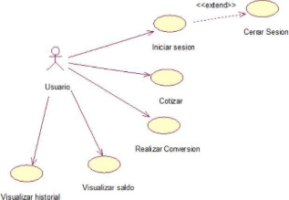

1. Vista Lógica
   1. ### Diagrama de Subsistemas (paquetes)
      
   1. ### Diagrama de Secuencia (vista de diseño)

Diagrama de Secuencia para Gestionar Usuarios

Diagrama de Secuencia para Gestionar Monedas

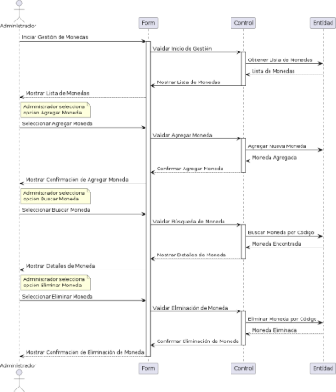

Diagrama de Secuencia para Gestionar Tasas de Cambio

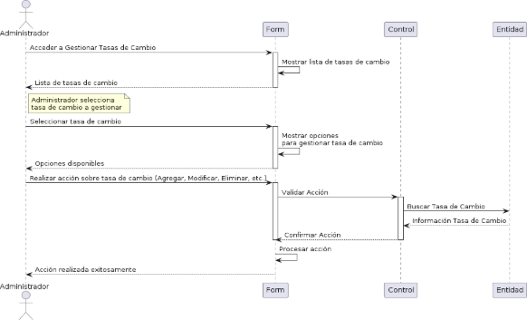

Diagrama de Secuencia para Cliente realizando una conversión

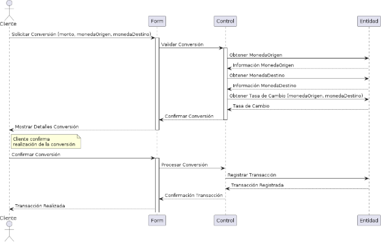

Diagrama de Secuencia: Cliente Consultando su Historial de Transacciones

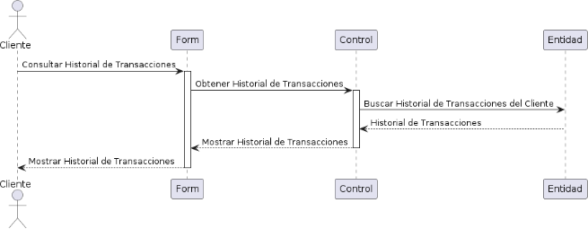

Diagrama de Secuencia: Cliente Consultando Saldo

Diagrama de Secuencia: Administrador actualiza Tasa de Cambio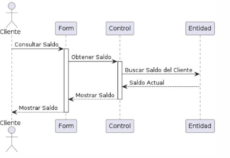

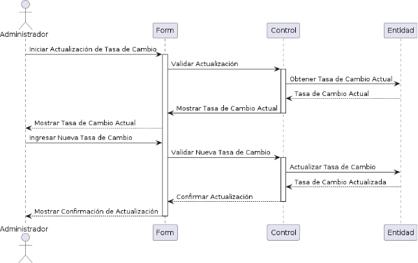

1. ### Diagrama de Colaboración (vista de diseño)

1. ### Diagrama de Objetos

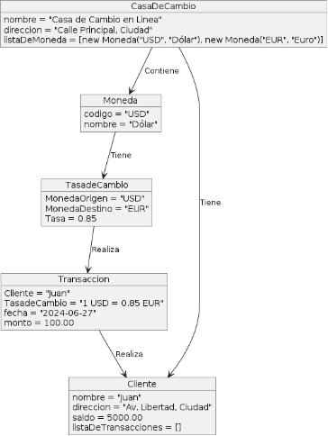

1. ### Diagrama de Clases

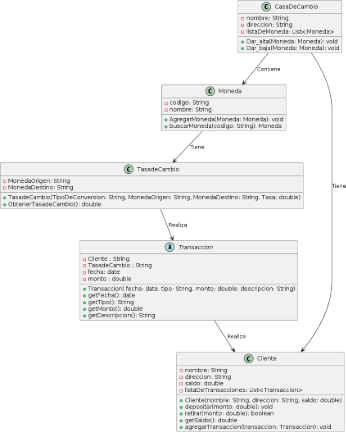

1. ### Diagrama de Base de datos

**Modelo lógico**

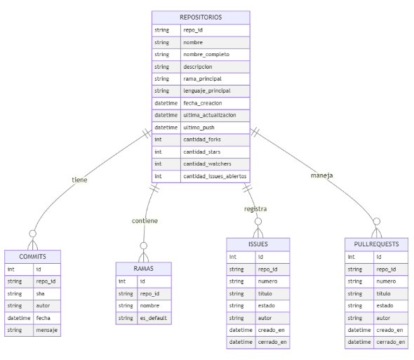

Link: <https://ibb.co/ycFBhKhD>

**Modelo físico**

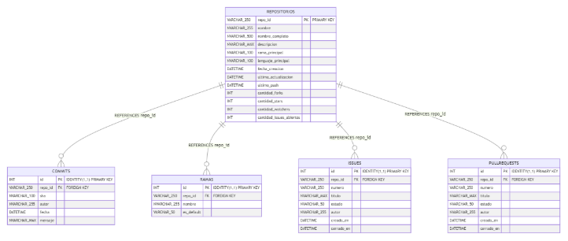

Link: <https://ibb.co/PGHvNk5G>

1. Vista de Implementación (vista de desarrollo)

   1. ### Diagrama de arquitectura software (paquetes)

1. ### Diagrama de arquitectura del sistema (Diagrama de componentes)

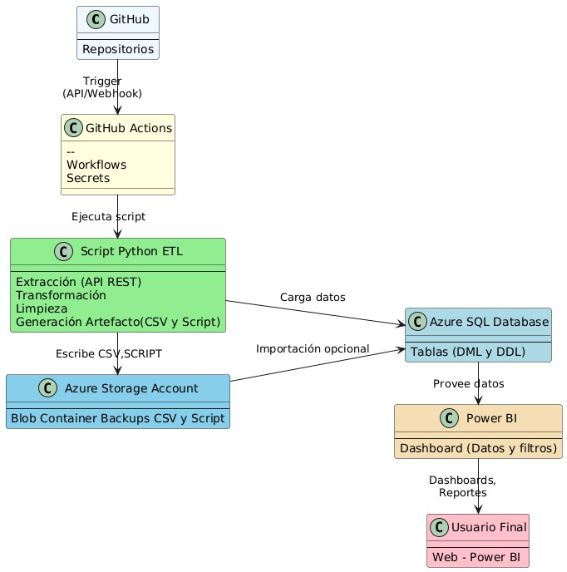

1. # **ATRIBUTOS DE CALIDAD DEL SOFTWARE**
##
## **Escenario de Funcionalidad**
**Descripción**: El objetivo de este escenario es garantizar que el sistema cumpla con las funcionalidades esperadas y definidas. Para ello, se ejecutaron pruebas unitarias y de integración, así como pruebas BDD que cubren los casos más críticos del sistema.

**Resultados**:

- Las **pruebas unitarias** mostraron un nivel de cobertura del 86%, lo que garantiza que una parte significativa del código esté validado. Algunos archivos clave, como currency\_manager.py y transaction\_manager.py, tienen una cobertura del 100%, lo que refleja que las funciones más críticas están adecuadamente probadas.
- Las **pruebas BDD** también reflejaron una alta tasa de éxito, con 4 características aprobadas y 15 escenarios que pasaron sin problemas, asegurando que las funcionalidades clave del sistema, como la creación de cuentas y la actualización de información de usuario, funcionan como se espera.

**Conclusión**: La cobertura de pruebas y los resultados de las pruebas BDD aseguran que el software cumple con los requisitos funcionales establecidos, aunque se puede mejorar la cobertura en áreas específicas del código.

- **Sugerencia**: **Incluir imagen o reporte de cobertura de pruebas unitarias** para ilustrar el porcentaje alcanzado y mostrar cómo se distribuye la cobertura entre los diferentes archivos.
## **Escenario de Usabilidad**
**Descripción**: Este escenario evalúa la facilidad de uso y la experiencia de usuario, asegurando que el software sea intuitivo y fácil de interactuar.

**Resultados**:

- Se realizaron **pruebas de interfaz de usuario** para validar aspectos clave, como la conversión de montos, la cotización y el inicio de sesión. Todas las pruebas fueron aprobadas con éxito y con tiempos de respuesta adecuados.
- Ejemplos de pruebas exitosas incluyen la validación de formularios vacíos, la no aceptación de montos negativos, y la verificación de errores de valor nulo. Además, las pruebas de cotización y de inicio de sesión también fueron completadas sin fallas.

**Conclusión**: Las pruebas de interfaz demuestran que el sistema es fácil de usar, y las interacciones se completan de manera eficiente y sin errores. La experiencia de usuario es positiva, lo que contribuye a la **usabilidad**.

- **Sugerencia**: **Incluir imágenes o capturas de pantalla de las pruebas de interfaz** que muestran las interacciones y los mensajes de error.

## **Escenario de Confiabilidad**
**Descripción**: Este escenario se enfoca en garantizar que el sistema funcione sin fallos y de manera consistente bajo condiciones normales de operación.

**Resultados**:

- Las pruebas de **mutantes** indican que las pruebas unitarias tienen una efectividad de "asesinato" del 76.69%, lo que significa que las pruebas están bien diseñadas para detectar errores.
- Las **pruebas BDD** también verificaron que las funcionalidades clave, como la creación de cuentas y las transacciones, se ejecutaron correctamente sin errores. Se manejaron adecuadamente las situaciones excepcionales, como la consulta de cuentas inexistentes, lo que contribuye a la confiabilidad del sistema.

**Conclusión**: El sistema ha demostrado ser confiable tanto en pruebas funcionales como en pruebas de mutantes, lo que garantiza que las funcionalidades principales están libres de errores en condiciones normales.

- **Sugerencia**: **Incluir los resultados de la prueba de mutantes**, especialmente la efectividad de "asesinato", para reforzar la evaluación de confiabilidad.
## **Escenario de Rendimiento**
**Descripción**: El rendimiento del sistema se mide evaluando la velocidad y la eficiencia de las operaciones, como tiempos de respuesta y consumo de recursos.

**Resultados**:

- Las **pruebas BDD** reflejan tiempos de respuesta muy rápidos en operaciones clave, como la actualización de información de usuario (1ms) y la creación de cuentas (menos de 1 segundo). Además, las **pruebas de interfaz** mostraron tiempos de carga razonables para la página de cotización (4.6 segundos) y para las transacciones.
- Todas las pruebas de funcionalidad relacionadas con las conversiones y el inicio de sesión se ejecutaron rápidamente, lo que sugiere que el sistema maneja las operaciones de manera eficiente.

**Conclusión**: El sistema muestra un excelente rendimiento en términos de tiempos de respuesta y eficiencia operativa, lo que es un indicador positivo para el uso en un entorno de producción.

- **Sugerencia**: **Incluir métricas de tiempo de respuesta de las pruebas BDD y de interfaz** para dar evidencia visual del rendimiento.

## **Escenario de Mantenibilidad**
**Descripción**: La mantenibilidad se evalúa observando qué tan fácil es realizar cambios, corregir errores y extender el sistema sin causar problemas adicionales.

**Resultados**:

- Las **pruebas unitarias** cubren la mayoría del código (86%) y algunos archivos específicos tienen una cobertura del 100%, lo que facilita futuras modificaciones y asegura que las funciones esenciales estén correctamente validadas.
- Las **pruebas de mutantes** muestran que las pruebas unitarias pueden detectar la mayoría de los errores introducidos, aunque hay áreas con una menor eficiencia (como test\_transaction\_manager.py con una eficiencia de 47.37%).

**Conclusión**: El sistema es altamente mantenible debido a la cobertura de pruebas amplia y la capacidad para detectar errores de manera efectiva. Aún hay áreas donde se pueden mejorar las pruebas para una cobertura más completa.

##

